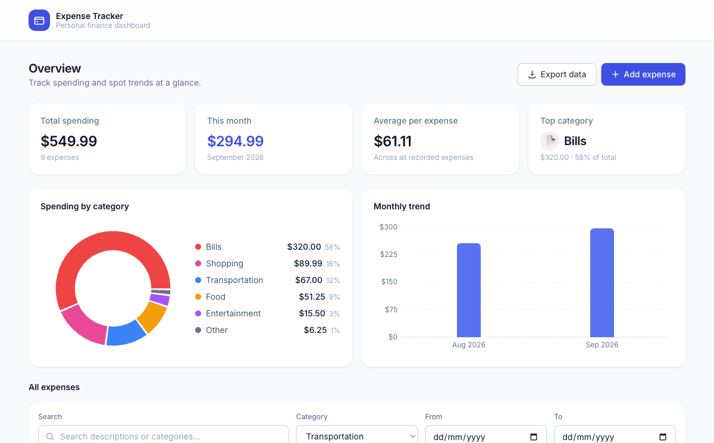
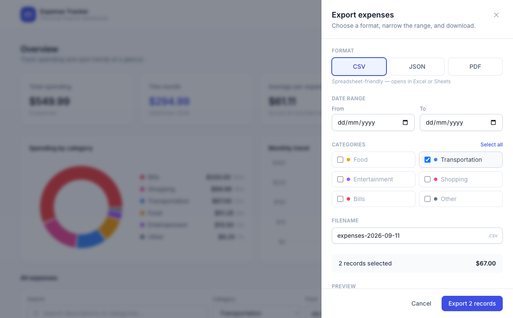

# How to export your filtered expenses

## What this does

If you've already narrowed the "All expenses" list using the filter bar — by category, date range, or both — clicking "Export data" now opens the Export panel with that same category and date range pre-selected, instead of starting over from scratch. You can still adjust the format, dates, and categories inside the Export panel before downloading; changing them there doesn't affect the filters on the main page.

## Before you start

You need at least one expense already added, and it helps to have applied a filter (category and/or date range) in the "All expenses" section first — otherwise the Export panel just opens with everything selected, same as before.

## Steps

1. In the "All expenses" section, set the filters you want — for example, choose "Transportation" from the **Category** dropdown.

   

2. Click **Export data** in the top-right of the page.
3. The Export panel opens on the right with the **Categories** section pre-checked to match your filter (only "Transportation" here) and the **Date range** From/To fields pre-filled if you had set them — the record count and preview reflect this automatically.

   

4. From here you can still change anything before exporting: pick a different **Format** (CSV/JSON/PDF), check or uncheck any **Category**, or adjust the **Date range** — these changes only apply to this export and won't change what's filtered on the main page.
5. Review the **Preview** table and the record count/total at the bottom, then click **Export N records** to download the file.

## Troubleshooting

- **The panel didn't pick up my filter** — only the main filter bar's Category and Date range (From/To) carry over; the **Search** box doesn't, since the Export panel has no equivalent search field. Also, the panel only re-reads the main filters each time you *open* it — if you change the main filter bar while the Export panel is already open, the open panel won't update until you close and reopen it.
- **I changed something in the Export panel by mistake** — just close the panel (Cancel or the X) and reopen it; it always re-seeds from your current main-page filters rather than remembering what you last had open.
- **I want to export everything, ignoring my current filter** — click "Select all" in the panel's Categories section and clear the From/To date fields; this only affects the export, not your main-page filter.

## Related

- See the [technical implementation](../dev/export-filter-persistence-implementation.md) for engineering details.
- See [How to filter your expenses](how-to-filter-expenses.md) for how the main filter bar itself works.
