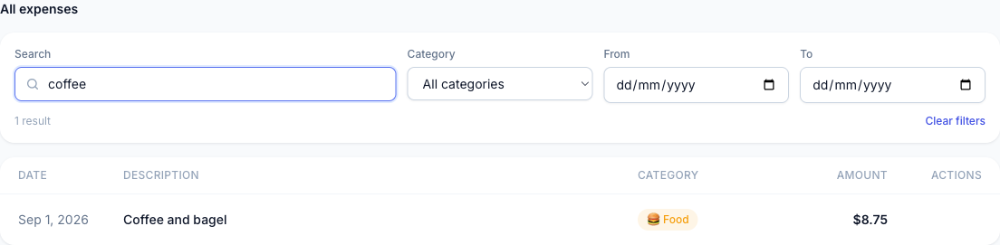
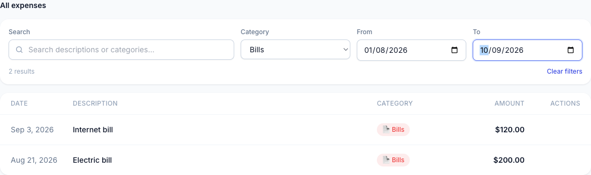

# How to filter your expenses

## What this does

The filter bar above your expense list lets you narrow it down to just the expenses you're looking for — by keyword, category, or date range — without changing or deleting anything.

## Before you start

You need at least one expense already added; the filter bar is always visible above the list, but there's nothing to narrow down on an empty list.

## Steps

1. Scroll to the "All expenses" section — the filter bar sits directly above the expense list.
2. To search by keyword, type into the **Search** box. It matches against both the description and the category of each expense as you type.

   

3. To narrow by category, choose one from the **Category** dropdown, or leave it on "All categories" to include every category.
4. To narrow by date, enter a **From** date, a **To** date, or both, using the date pickers. Leave either one blank to leave that side of the range open.

   

5. Watch the result count under the filter bar — it updates immediately to show how many expenses match your current filters. In the screenshot above, combining the Bills category with the date range narrowed the list to "2 results."
6. To start over, click **Clear filters**, which appears next to the result count as soon as any filter is active — visible in the top-right of the screenshot above.

## Troubleshooting

- **I get zero results and I'm sure the expense exists** — check whether your From date is later than your To date; the app doesn't warn you about an inverted range, it just shows no matches. Also confirm the Category dropdown isn't set to something other than "All categories."
- **My search isn't finding an expense I know is there** — search only checks the description and category text, not the amount or date, so searching for a dollar amount or a date won't match.
- **"Clear filters" isn't showing up** — it only appears once at least one filter (search, category, or a date) differs from its default; if all filters are already at their defaults, there's nothing to clear.
- **My filters disappeared after I reloaded the page** — this is expected: filters aren't saved between visits, so the list resets to showing everything each time you reload.

## Related

See the [technical implementation](../dev/filter-expenses-implementation.md) for engineering details.
