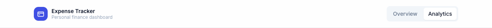
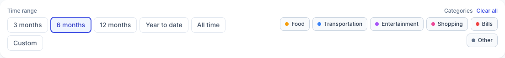
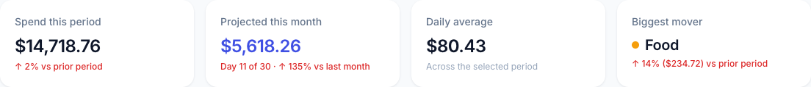
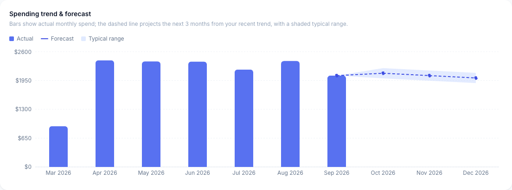
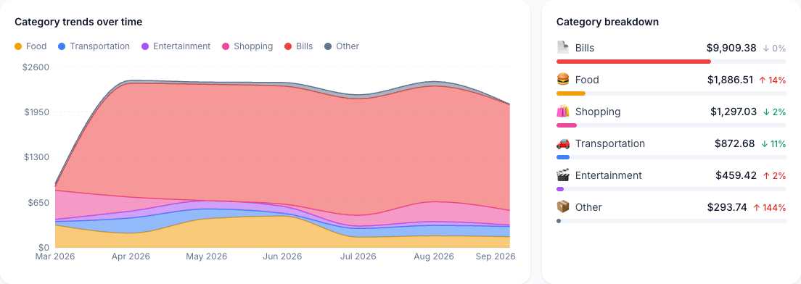
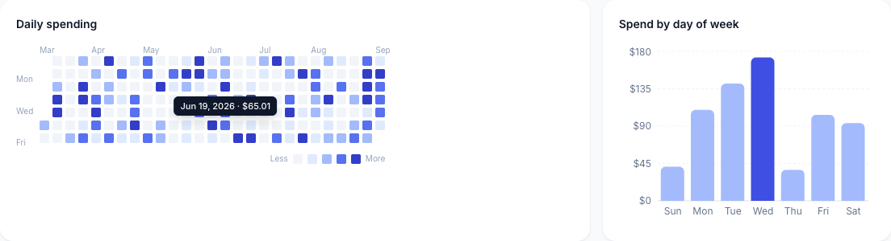
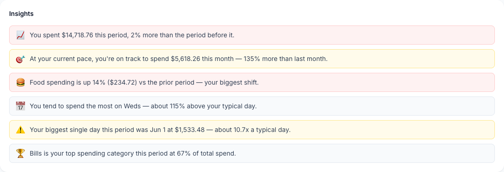

# How to use the analytics dashboard

## What this does

The Analytics page gives you a deeper view of your spending than the Overview page: multi-month trends, a short-term forecast, category patterns over time, a day-by-day spending map, and a set of plain-English callouts about what's changed. Everything on this page reads from the same expenses you've already entered — there's nothing extra to set up.

## Before you start

You'll get the most out of this page with at least a couple of months of expenses recorded. With very little data, most charts will show a "not enough data yet" message instead of a chart — that's expected, not an error.

## Steps

1. From the Overview page, click **Analytics** in the top-right navigation.

   

2. Choose a **time range** — 3 months, 6 months, 12 months, year to date, all time, or a custom range with your own start/end dates.

   

3. Optionally narrow the whole page to specific **categories** by clicking their chips (they toggle on/off; "Select all"/"Clear all" resets them). Every chart, KPI, and insight below updates to match.
4. Review the four KPI cards: spend this period (vs. the same-length period before it), your projected total for the current month at your current pace, your daily average, and the category with the biggest dollar swing.

   

5. Scroll to **Spending trend & forecast**. Solid bars are your actual monthly spend; the dashed line and shaded band project the next 3 months based on your recent trend — treat it as a "if things keep going this way" estimate, not a guarantee.

   

6. Below that, **Category trends over time** shows how each category's spend has moved month to month (stacked, so the top edge is your total), and **Category breakdown** lists each category's total for the selected period with its change vs. the prior period.

   

7. **Daily spending** is a calendar heatmap — darker squares mean more spend that day. Hover any square to see its exact date and amount. **Spend by day of week** shows which day of the week tends to cost you the most.

   

8. Read the **Insights** section at the bottom — a short list of plain-English observations (e.g. "You spent 14% more on Food than the prior period") computed automatically from the data above. It updates as you change the time range or categories.

   

## Troubleshooting

- **A chart says "no data" even though I have expenses** — check your selected time range and categories at the top of the page; a narrow range or a deselected category can easily exclude everything.
- **The forecast line looks flat or short** — it needs at least two months of history in your selected range to draw a trend; with only one month, it holds flat at that month's value instead of guessing at a slope.
- **"Biggest mover" says "Not enough data yet"** — this needs spending in both the current period and the one before it to compute a change; it won't show anything for your very first period of use.
- **My changes to the time range or categories disappeared after reloading** — this is expected, the same as the filters on the Overview page: dashboard selections aren't saved between visits.

## Related

See the [technical implementation](../dev/analytics-dashboard-implementation.md) for engineering details.
