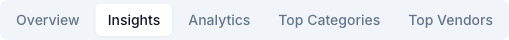
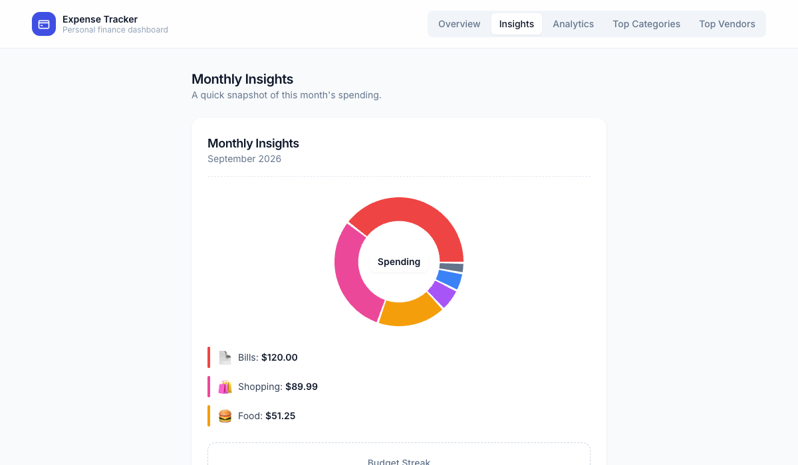
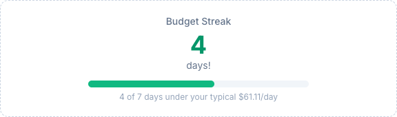

# How to view your monthly insights

## What this does

The Insights page gives you a quick, single-glance snapshot of this month's spending: a donut chart of what you've spent by category, your top 3 categories with their dollar amounts, and a "Budget Streak" — how many days in a row you've kept your daily spending at or under your own typical amount. It reads from the same expenses you've already entered — there's nothing extra to set up.

## Before you start

You'll want at least a few expenses logged this month to see a chart. With none yet, the page shows a short message instead of an empty chart, and the Budget Streak panel prompts you to log a few days of spending before it can start counting.

## Steps

1. From any page, click **Insights** in the top navigation.

   

2. Review the **donut chart** for a visual breakdown of this month's spending by category, and the **top 3 categories** listed below it with their exact amounts.

   

3. Check your **Budget Streak** at the bottom of the card — the big number is how many consecutive days (counting back from today) you've spent at or under your typical daily amount, shown in the caption below the progress bar. The bar fills toward your next milestone (7, 14, 30, 60, 90, 180, or 365 days).

   

## Troubleshooting

- **The chart says "No spending logged this month yet"** — this page only looks at the current calendar month; expenses from prior months won't show here even if they exist. Check the Overview or Analytics page for historical spending.
- **My Budget Streak says 0 and asks me to "log a few days"** — the streak needs at least one day with recorded spending to establish your typical daily amount before it can start counting; it isn't a bug, it just hasn't got a baseline yet.
- **My streak seems shorter than I expected** — the streak compares each day's total spending to your own average daily spend (on days you spent anything) — not a budget you set yourself. A single higher-than-usual day resets the count back to zero starting the next day.
- **Fewer than 3 categories are listed** — the top-3 list only shows categories you've actually spent in this month; with 1 or 2 categories active, that's all that appears.

## Related

- See the [technical implementation](../dev/monthly-insights-implementation.md) for engineering details, including exactly how the Budget Streak is calculated.
- [How to use the analytics dashboard](how-to-use-the-analytics-dashboard.md) — for multi-month trends, forecasts, and historical spending patterns beyond the current month.
